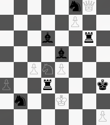

# game-of-pawns

[](https://travis-ci.com/charleskorn/game-of-pawns)

The April TW Shokunin challenge: generate a semi-realistic random chess board according to some rules.

## Requirements

* JDK 1.8 or later

## Usage

For a FEN-formatted chess board, run `./go.sh --fen`. This produces output like:

```
4K3/6N1/2n1P3/P7/2p3k1/3R4/2P5/2P5 w - - 0 1
```

For a plain text chess board, run `./go.sh --grid`. This produces output like:

```
.  .  .  .  .  .  .  .
.  .  .  .  .  .  .  .
.  .  .  k  .  .  .  K
N  .  .  .  .  .  n  .
.  .  .  r  .  .  .  .
.  N  .  .  n  .  .  .
P  .  r  .  .  .  .  .
.  .  .  .  .  P  R  .
```

For a pretty-printed chess board, run `./go.sh --pretty`. This produces output like the following on a supported terminal:



`go.sh` will automatically download any missing dependencies and compile the application if required.
